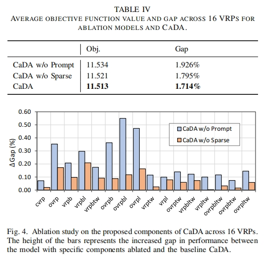
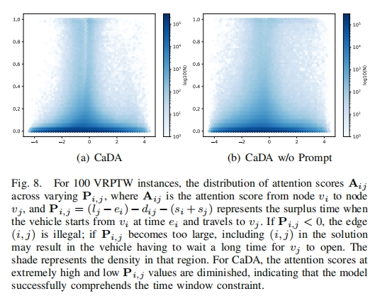

## [论文 arxiv 链接](https://arxiv.org/pdf/2412.00346)

`2024/12/23` 组会分享。

<!-- more -->

## 一、实验目的

- 开发一种能够有效处理多种车辆路径问题（$VRP$）变体的模型，以解决现实世界中不同场景下的车辆路径规划需求。随着 VRP 在交通运输、物流和制造业等领域的广泛应用，其众多变体和复杂约束对模型的跨问题能力提出了挑战。
- 提高模型对约束的感知能力，使模型能够在处理不同 VRP 变体时，充分考虑到如容量（Capacity）、开放路线（Open Route）、回程（Backhaul）、持续时间限制（Duration Limit）和时间窗口（Time Window）等约束条件，从而生成更符合实际情况的解决方案。
- 改进模型的表示学习能力，通过创新的架构设计，如引入双注意力机制，使模型能够更有效地学习节点之间的关系，提高节点表示的质量，进而提升模型在 VRP 求解中的性能。
- 与现有方法相比，验证所提出的 CaDA 模型在处理 $16$ 种不同 VRP 变体时的有效性和优越性，为 VRP 的研究和实际应用提供更高效的解决方案。

## 二、实验原理

### 问题定义

1. $VRP$ 实例表示：VRP 实例为完全连接图，包括节点集合 $V = \lbrace v_0, v_1, \cdots, v_n\rbrace$（$v_0$ 为仓库，其余为客户节点）和边集合 $E = V \times V$。节点 $v_i$ 包含坐标 $\vec{X_i} \sim U(0,1)^2$ 和属性 $A_i$，节点间旅行成本由欧氏距离定义。

2. 基本 $CVRP$：仓库节点 $v_0$ 属性为空，客户节点 $v_i$ 有需求 $\delta_i$，车辆从仓库出发，服务客户后返回仓库，目标是最小化总旅行成本。

3. 扩展约束
    - 开放路线（$O$）：车辆完成子路线后不返回仓库。
    - 时间窗口（$TW$）：节点必须在特定时间窗口内被访问，车辆需考虑服务时间和时间限制。
    - 回程（$B$）：客户分为送货（linehaul）和取货（backhaul）两类，送货任务需在取货任务前完成。
    - 子路径长度限制（$L$）：每个子路线必须在规定长度内完成，确保车辆能在阈值内返回仓库。

### 学习构建 VRP 解决方案

1. 建模为 $MDP$：将 VRP 解决方案的构建过程建模为 MDP，然后用强化学习生成策略。
2. 策略模型：采用基于神经网络的策略 $\pi_{\theta}$，参数为 $\theta$，通过学习生成解决方案。策略的概率分布通过自回归方式计算，即 
$$\pi_{\theta}(\tau \mid V) = \prod\limits_{t = 1}^{T} \pi_{\theta}(a_t \mid s_t) = \prod\limits_{t = 1}^{T}\pi_{\theta}(\tau_t \mid \tau_{t - 1},V).$$

3. 奖励函数：当生成完整可行解 $\tau_T$ 时，获得奖励 $r(\tau_T) = -\sum\limits_{t = 1}^{T - 1}d_{\tau_t\tau_{t + 1}}$，模型通过强化学习方法优化策略，以最大化预期奖励。

### Transformer 层

1. 注意力层（Attention Layer）：采用经典的多头注意力机制，通过计算 $query$、$key$ 和 $value$ 之间的注意力分数，对输入进行加权求和，实现对不同节点信息的关注和融合。注意力函数为 
$$\begin{align*}Attention(X,Y) = A(YW_v), \\ A = Softmax(\frac{XW_Q(YW_k)^T}{\sqrt{d_k}}).\end{align*} \\ $$

2. 门控线性单元（Gated Linear Unit）：在 Transformer 块中，使用 SwiGLU 作为前馈网络的激活函数，替代传统的 ReLU 激活函数，以提高模型的表达能力。SwiGLU 定义为 
$$SwiGLU(X) = X \odot \sigma(XW_1 + b_1) \otimes SiLU(XW_2 + b_2). \\ $$
 其中 $\odot$ 是点乘，$\otimes$ 是矩阵乘，$\sigma$ 是 sigmoid 函数，$W_1, W_2, b_1, b_2$ 是可学习参数。

## 三、实验过程

### 总体框架

CaDA 遵循 VRP 的跨问题学习框架，包括编码和解码两个阶段。在编码阶段，将 VRP 实例转换为节点嵌入（node embeddings），并引入约束提示（constraint prompt）和双注意力机制（dual-attention mechanism）来增强表示学习；在解码阶段，基于编码后的节点嵌入逐步构建解决方案。

如下图所示。

### 约束提示（Constraint Prompt）

1. 生成提示向量：将 VRP 问题表示为一个对应五种约束的多热向量 $V \in \mathbb{R}^5$，然后通过多层感知机（$MLP$）处理生成提示 $P^{(0)}$，即 
$$P^{(0)} = LayerNorm((VW_a + b_a) + W_b + b_b, \\ $$
 其中 $W_a \in \mathbb{R}^{5 \times d_h}, b_a \in \mathbb{R}^{d_h}, W_b \in \mathbb{R}^{d_h \times d_h}, b_b \in \mathbb{R}^{d_h}$ 为可学习参数，$d_h$ 为节点嵌入维度。
2. 与节点嵌入结合：将生成的提示 $P^{(0)}$ 与节点嵌入 $H^{(0)}$ 进行拼接，以便在后续处理中引入约束信息。

### 双注意力机制（Dual-Attention Mechanism）

1. 全局分支（Global Branch）
    - 节点嵌入初始化：将输入实例 $V$ 通过线性投影转换为高维初始节点嵌入 $H^{(0)} \in \mathbb{R}^{(N + 1) \times d_h}$。
    - 多层处理：全局分支由 $L$ 层组成，每层包含标准多头注意力层（MHA）和 SwiGLU 激活函数。在第 $i$ 层，节点嵌入 $H_g^{(i - 1)}$ 与提示 $P^{(i - 1)}$ 拼接后，经过 MHA 和 SwiGLU 处理，并通过残差连接和 RMSNorm 进行归一化，更新节点嵌入为 $\widetilde{H}_g^{(i)}$ 和提示为 $P^{(i)}$。
2. 稀疏分支（Sparse Branch）
    - 注意力层替换：稀疏分支同样由 $L$ 层组成，但在注意力层中，使用 Top-k 稀疏注意力（SparseAtt）替代标准注意力，通过将小于 Top-k 分数的注意力值设为零，使模型聚焦于最相关的节点。SparseAtt 定义为 
$$SparseAtt(X,Y) = Softmax(M(A))YW_V, \\ $$
 其中 $M(\cdot)$ 为 Top-k 选择操作，它选择每行注意力分数中的前 $k$ 个最高值，其余设为零。
    - 信息融合：在每层结束时，通过简单线性投影将全局分支和稀疏分支的信息进行融合（即 $g$ 用 $s$ 更新，$s$ 用 $g$ 更新），得到更新后的节点嵌入 $H_g^{(i)}$ 和 $H_s^{(i)}$。

### 解码器（Decoder）

1. 上下文嵌入计算：在解码阶段，利用全局分支输出的节点嵌入 $H^{(L)} = [h_0^{(L)}, h_1^{(L)}, \cdots, h_N^{(L)}]$ 构建解决方案。在每个解码步骤 $t$，根据已生成的部分解 $\tau_t$ 和当前状态信息（如车辆剩余容量、当前时间、剩余路线长度、开放路线指示等）计算上下文嵌入 $H_c$。
2. 动作选择：上下文嵌入 $H_c$ 通过 MHA 生成最终查询 $q_c$，然后计算每个可行动作的兼容性得分 $u_i$，公式为 
$$u_i = \begin{cases}\xi \cdot tanh\left( \frac{q_c(h_i^{(L)})^T}{\sqrt{d_k}}\right) \ &if \ \ i \in I_t \\ -\infty &otherwise\end{cases}, \\ $$
 再通过 Softmax 函数得到动作概率 
$$\pi_{\theta}(\tau_g = i \mid V, \tau_{1: g - 1}). \\ $$
 在计算动作概率时，需根据 VRP 的约束条件确定可行动作集合 $I_t$，具体规则如下：
    - 每个客户节点只能被访问一次，若仓库是部分解的最后一个动作，则下一个动作不能是仓库，以避免自环。
    - 对于无开放路线约束的问题，每个子路线需在规定限制内返回仓库，涉及时间窗口约束（有时间限制 ）和距离限制约束（有距离限制 ），若不满足相应条件，则节点不可用。
    - 对于有时间窗口约束的问题，车辆必须在客户节点的时间窗口内访问并完成服务，否则节点不可用。
    - 对于有回程约束的问题，若仍有未完成的送货任务，则取货任务将被屏蔽，相应节点不可用。
    - 客户节点的需求不能超过当前车辆的可用容量，否则节点不可用。

### 实验设置

#### 1. 问题设置

- 节点位置：节点位置由二维向量 $\vec{X}_i$ 表示，其值从均匀分布 $U(0, 1)$ 中采样得到。
- 车辆容量：仅考虑同构车辆，即所有车辆共享相同容量 $c$。在节点数量 $N = 50$ 时，容量 $c$ 设为 $40$；$N = 100$ 时，$c$ 设为 $50$。车辆数量无限制。
- 节点需求：客户分为送货（linehaul）和取货（backhaul）两类，需求通过均匀采样生成。对于所有客户 $i \in \lbrace 1, 2, \cdots, N \rbrace$，先从整数集 $\lbrace 1, 2, \cdots, 9 \rbrace$ 中均匀采样生成送货需求 $\delta_i^l$，若未设置回程约束，节点的真实需求 $\delta_i$ 等于 $\delta_i^l$；若设置了回程约束，再从相同整数集中均匀采样生成取货需求 $\delta_i^b$，并通过临时变量 $y_i \sim U(0, 1)$ 确定节点需求，当 $y_i < 0.2$ 时才设置 $\delta_i = \delta_i^b$。为保证训练稳定性，将需求 $\delta_i$ 归一化到范围 $[0, 1]$，确保解码过程中剩余容量在合理范围内。
- 时间窗口：对于含时间窗口约束的问题，需考虑时间窗口 $[e_i, l_i]$ 和服务时间 $s_i$。仓库的 $e_0 = s_0 = 0$，$l_0 = T = 4.6$（$T$ 为每个子路线的时间限制），车辆速度设为 $1.0$。对于客户节点 $i \in \lbrace 1, 2, \cdots, N \rbrace$，服务时间 $s_i$ 从 $[0.15, 0.18]$ 中均匀采样，时间窗口长度 $\Delta t_i$ 从 $[0.18, 0.20]$ 中均匀采样，且每个客户的时间窗口必须保证路线可行，否则无可行路线服务该客户。时间窗口的开始时间 $e_i$ 根据下列公式计算得到 
$$\begin{align*} e_i^{up} &= \frac{T - s_i -\Delta t_i}{d_{0i}} - 1, \\ e_i = \ &(1 + (e_i^{up} - 1)\cdot y_i) \cdot d_{0i}, \\ \end{align*}$$
 其中 $y_i \sim U(0, 1)$。而结束时间 $l_i = e_i + \Delta t_i$。
- 距离限制：对于含距离限制约束的问题，每个子路线长度需在限制 $\rho$ 内，为确保每个实例有可行解，$\rho$ 从 $U(2 \cdot \max(d_{0*}), \rho_{\max})$ 中采样，其中 $\rho_{\max} = 3.0$ 为预定义上限。

#### 2. 基线方法选择

选用了包括 PyVRP、Google's OR-Tools 等传统求解器以及 MTPOMO、MVMoE、RouteFinder 等先进的神经网络求解器作为基线方法，以全面评估 CaDA 模型的性能。

#### 3. 测试与硬件

使用 Routefinder 发布的测试数据集，包含 $1K$ 个随机生成的实例，分别用于 $16$ 种 VRP 变体在 $50$ 和 $100$ 节点规模下的测试。所有神经网络求解器在相同规模下进行训练和测试。在测试过程中，所有神经网络求解器采用贪心展开策略（greedy rollout strategy）并结合 ×8 增强（×8aug）方法，即对原始实例进行等效变换。

## 四、实验数据分析

### 1. 主要结果分析

- 从表 III 中可以看出，CaDA 在不同 VRP 变体和不同规模（$50$ 个节点和 $100$ 个节点）下均表现出色。在 VRP50 和 VRP100 中，CaDA 分别超越了第二好的方法 $0.26\%$ 和 $0.32\%$，在所有基于神经网络的求解器中，对于 VRP50 的所有变体以及 VRP100 的 $13$ 个变体中排名第一。
- 与传统启发式求解器相比，CaDA 显著减少了运行时间。这表明 CaDA 不仅能找到高质量的解决方案，还能在效率上与传统方法竞争，提高了实际应用中的可行性。

**【Gap 和有些最佳 Obj. 疑似对不上，可能 arxiv 上不是终稿】**

    

    

### 2. 消融实验分析

- 表 IV 展示了消融实验结果，验证了 CaDA 中各组件的有效性。去除约束提示（CaDA w/o Prompt）和 Top-k 操作（CaDA w/o Sparse）后，模型性能均有所下降，Gap 值分别增加到 $1.926\%$ 和 $1.795\%$，而原始 CaDA 的 Gap 值为 $1.714\%$（baseline 为 HGS-CVRP 和 OR-Tools），说明约束提示和稀疏操作对模型性能提升有重要贡献，尤其是约束提示作用更为显著。
- 从图 $4$ 中不同 VRP 数据集上的 Gap 增加情况可以看出，这两个部分在所有 VRP 变体上均有助于提高性能。

    

### 3. 不同设置对 CaDA 的影响分析

- 提示位置：将提示分别放置在全局分支和稀疏分支进行实验（图 $5(a)$），结果表明将提示放置在全局分支能获得更好性能，若放置在稀疏分支可能因被稀疏函数屏蔽导致约束信息不足，从而降低模型性能。
- 稀疏函数：用标准 Softmax 和 $\alpha$ -$entmax$（$\alpha = 1.5$ 和 $\alpha = 2$）替换 CaDA 中的 Top-k 稀疏操作（图 $5(b)$），发现采用不同稀疏函数的 CaDA 版本均优于仅含全局连接的标准 Softmax 版本，说明 Top-k 操作在 VRP 问题上表现更优。
- Top-k 值：对不同 $k$ 值（$k \in \lbrace \frac{N}{2}, \frac{N}{4}, \frac{N}{8} \rbrace$）的实验（图 $6$）表明，$k = \frac{N}{2}$ 时 CaDA 性能最佳，此时稀疏分支能更好与全局分支协作，$k = \frac{N}{4}$ 时性能稍差，$k = \frac{N}{8}$ 时性能大幅下降。

    

### 4. 约束感知可视化分析

- 开放路线约束影响：通过高斯核进行核密度估计（一种基于有限样本估计总体分布的方法），并用热图可视化，分析 CaDA 和 CaDA w/o Prompt 在 CVRP 和 OVRP 上客户与仓库间注意力权重分布（图 $7$），发现 CaDA 在两种问题上注意力分布不同，而 CaDA w/o Prompt 分布相似，导致任务间干扰增加。CaDA 在 OVRP 中对仓库的高注意力值密度更低，表明约束提示能有效提供信息，帮助模型理解问题。
- 时间窗口约束影响：对于时间窗口约束，分析节点对间注意力分数 $A_{ij}$ 与 $P_{ij}$（$P_{ij} = (l_j - e_i) - d_{ij} - (s_i + s_j)$）的关系（图 $8$），CaDA 对 $P_{ij} < 0$ 和 $P_{ij} > 3$ 的高注意力值更少，说明 CaDA 能更有效理解时间窗口约束，避免选择不可行或低效的节点对。

    

### 5. 真实数据集结果分析

- 表 V 展示了 CaDA 在 CVRPLib 数据集上不同 $k$ 值测试的平均 Gap，$k = 25$ 时 CaDA 性能最佳，表明在处理真实世界实例时，合适的 $k$ 值选择对模型性能至关重要。
- 表 VI 对比了 CaDA 与其他跨问题神经网络求解器在五个测试套件上的结果，CaDA 在使用 ×32 数据增强方法后（$CaDA_{25} \times 32$）取得了最佳性能，进一步证明了 CaDA 在实际应用中的有效性和优越性。

    

    

## 五、总结

这篇论文提出了约束感知双注意力模型（CaDA），这是一种新的跨问题神经求解器，用于解决 VRP 及其变体。CaDA 结合了约束提示和双注意力机制，该机制包括一个全局分支和一个稀疏分支，以此高效地生成具有约束意识的节点嵌入。

文章对 CaDA 在 $16$ 种 VRP 变体和现实世界基准实例上进行了彻底的评估。与当前领先的神经求解器相比，CaDA 显示出优越的性能。额外的消融研究证实了所提出的约束提示和双注意力模型结构的有效性。
